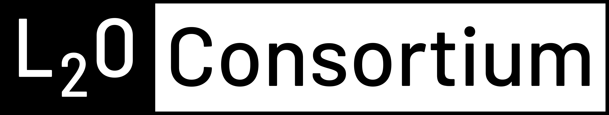
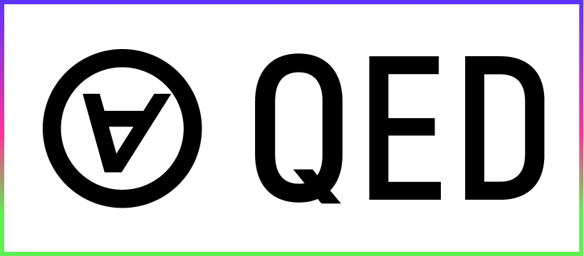

<!-- Improved compatibility of back to top link: See: https://github.com/othneildrew/Best-README-Template/pull/73 -->

<a name="readme-top"></a>

<!-- PROJECT LOGO -->
<br />
<div align="center">
  <a href="https://l2o.io">
    
  </a>

  <h3 align="center">Layer 2 Ordinals</h3>

  <p align="center">
    STANDARDS FOR TRUSTLESS APPLICATIONS ON BITCOIN
    <br />
    <a href="https://github.com/L2Ordinals/l2o-core"><strong>Reference Implementation »</strong></a>
    <br />
    <br />
    <a href="https://l2o.io/docs/l2o-a">Docs</a>
    ·
    <a href="https://github.com/L2Ordinals/l2o-core/issues">Report Bug</a>
    ·
    <a href="https://github.com/L2Ordinals/l2o-core/issues">Request Feature</a>
  </p>
<h3>Official Partners</h3>

  <a href="https://qedprotocol.com">
    
  </a>

</div>

## Requirements

- bitcoin-cli
- ord
- ordhook

## Getting Started

Launch bitcoin and electrs API and clean old data
```bash
make relaunch 
```

Initialize and fund the ord wallet
```bash
make ord-init
```

Start the indexer service
```bash
make run-indexer-ordhook 
```

Start the ordhook service
```bash
make run-ordhook
```

Start the mock l2 sequencer which keeps generating groth16 proofs
```bash
make run-l2o-sequencer
```

<hr />
<h4>License</h4>

Copyright 2023 Zero Knowledge Labs Limited

Permission is hereby granted, free of charge, to any person obtaining a copy of this software and associated documentation files (the “Software”), to deal in the Software without restriction, including without limitation the rights to use, copy, modify, merge, publish, distribute, sublicense, and/or sell copies of the Software, and to permit persons to whom the Software is furnished to do so, subject to the following conditions:

The above copyright notice and this permission notice shall be included in all copies or substantial portions of the Software.

THE SOFTWARE IS PROVIDED “AS IS”, WITHOUT WARRANTY OF ANY KIND, EXPRESS OR IMPLIED, INCLUDING BUT NOT LIMITED TO THE WARRANTIES OF MERCHANTABILITY, FITNESS FOR A PARTICULAR PURPOSE AND NONINFRINGEMENT. IN NO EVENT SHALL THE AUTHORS OR COPYRIGHT HOLDERS BE LIABLE FOR ANY CLAIM, DAMAGES OR OTHER LIABILITY, WHETHER IN AN ACTION OF CONTRACT, TORT OR OTHERWISE, ARISING FROM, OUT OF OR IN CONNECTION WITH THE SOFTWARE OR THE USE OR OTHER DEALINGS IN THE SOFTWARE.
